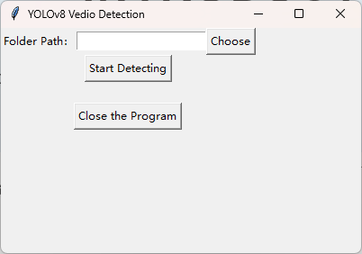
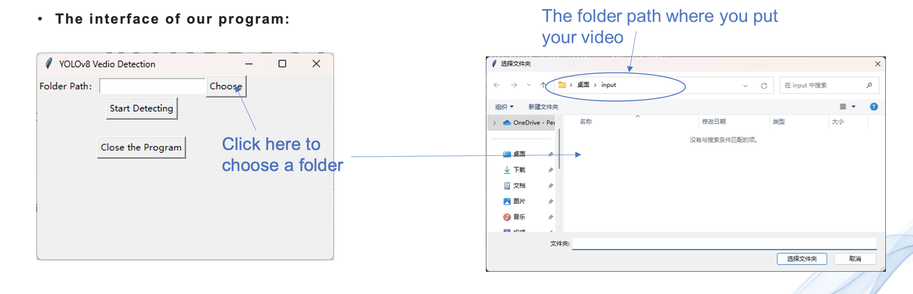
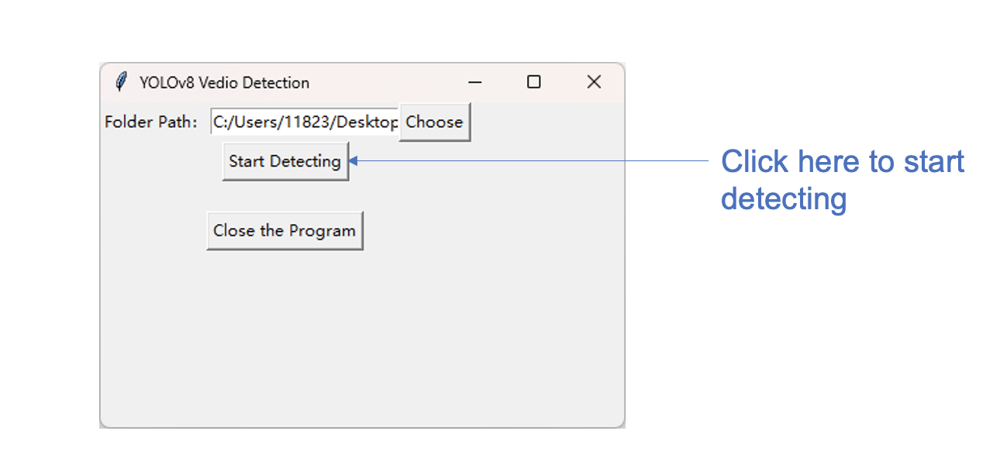
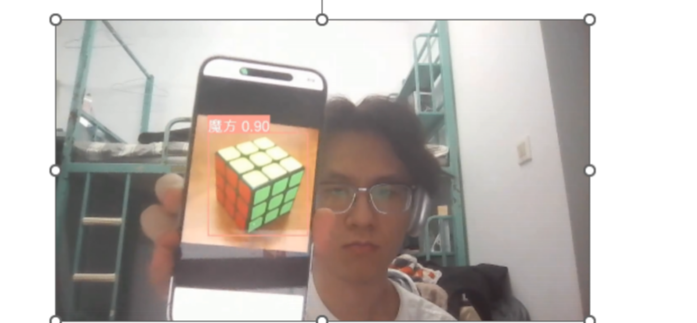
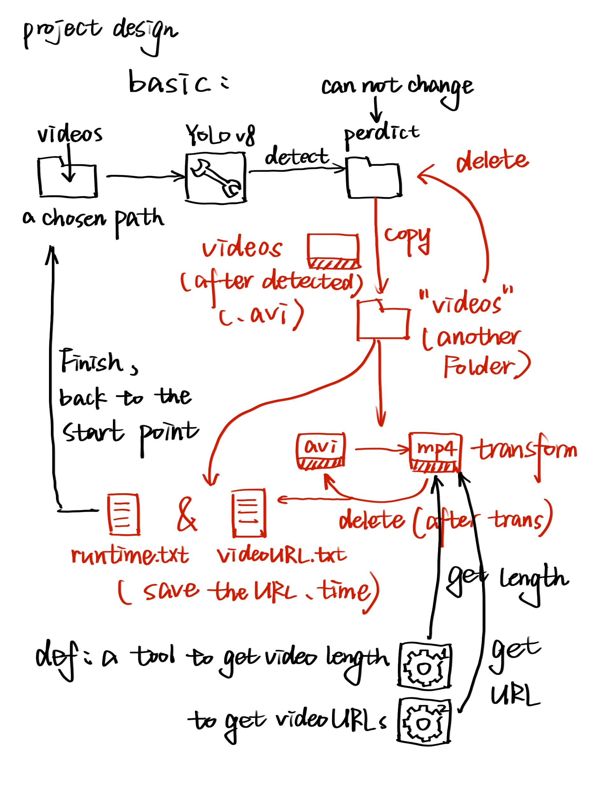
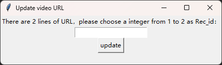
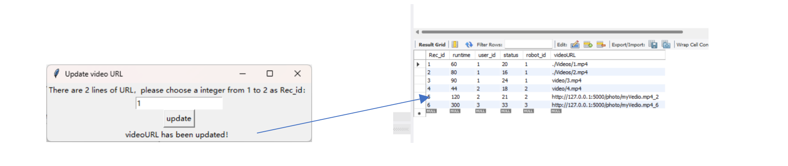
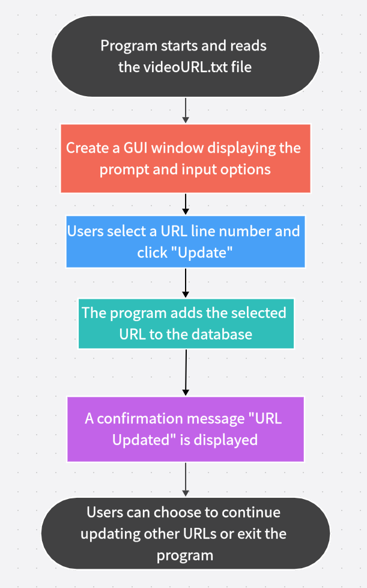

# GUI Documentation

## 1. Introduction
The Identification System is based on yolov8 and it can automatically identify and label objects in videos and pictures.

## 2. User Interface
The user interface is clear and straightforward, featuring the following main functionalities:

- A button to choose the directory.
- A button to start detection.
- A textbox to display the path of the selected directory.

## 3. Preparation Functional Description

### 3.1. Video Conversion from AVI to MP4
**Function:** Convert video files from AVI format to MP4 format.  
**Output:** URL of the video in MP4 format.

### 3.2. Retrieve Video Duration
**Function:** Calculate and return the length of the video.  
**Code Steps:**
1. Load the video.
2. Obtain the frame count and frame rate (FPS).
3. Calculate video duration.
4. Convert the duration into string format.

## 4. Instructions for use

### 4.1. Choose Directory
**Function:** Allow the user to select a specific directory to store videos to be detected.

### 4.2. Start Detection
**Function:** Initialize and start the object detection process.  
Then click this button, the program will automatically start to detect this path under the video (pictures can be!)

**Code Steps:**
1. Initialize variables.
2. Check file type.
3. If the file is in AVI format, convert to MP4 format.
4. Load video for detection.
5. Save detection results.
6. Manage resources.

### 4.3. Result

Here is the result, the videos which have been identified and labeled.

This diagram provides a visual representation of the pipeline flow for the Identification System.

# Video Upload and Database Update Program Design Document

## 1. Background
The purpose of this program design is to implement an automated process that not only saves recognized and tagged videos but also saves the video's URL and runtime information into a database. With this program, users can easily update and view video information.

## 2. Main Features
- Read the file storing video URLs and get the total number of lines in the file.
- Provide an option via the Graphical User Interface (GUI) allowing users to select the line number of the URL they want to update.
- After the user clicks "Update", the selected URL will be added to the database.

## 3. Technical Details

### 3.1 Data Storage
- **File path:** `D:\\path\\video\\videoURL.txt`
- **Database connection:** Connect to the MySQL database using the pymysql library.

### 3.2 GUI Design
Create a basic GUI window using the tkinter library. The window will include:
- A prompt label informing users how many URLs are available for selection.
- An input box for users to enter the line number of the URL they want to update.
- An update button. When clicked, the selected URL will be added to the database.

### 3.3 Database Operations
Execute database operations using the pymysql library.
- When the user clicks the "Update" button, the selected URL will be added to the respective database table.

## 4. Instruction for use

### 4.1 Choose URL to update
Choose one URL to update by entering an integer number representing the corresponding URL line in `videoURL.txt`.

### 4.2 Click update button
Click update to add the `videoURL` to the database.

### 4.3 Flowchart

